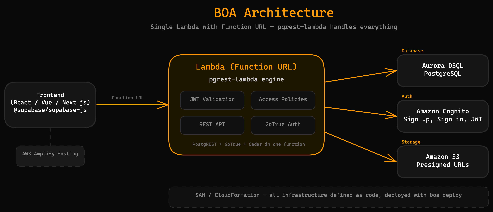

# How BOA Works

BOA deploys one opinionated stack to your AWS account: PostgreSQL database, managed auth, auto-generated REST API, and private file storage. You own everything. It scales to zero when idle and handles millions of users without changing a line of code.

## The Stack

| Layer | Service | Why |
|-------|---------|-----|
| Database | Aurora DSQL | Serverless PostgreSQL. SQL you know. Scales to zero, pay per operation. |
| Auth | Amazon Cognito | Managed sign-up/sign-in. 10,000 MAU free tier. |
| Engine | pgrest-lambda (npm) | Auto-generates REST + auth endpoints on Lambda. Supabase-compatible. |
| Compute | AWS Lambda (Node.js 20.x) | No servers. Sub-second cold starts. 1M free requests/month. |
| API | API Gateway (REST) | Routes requests, validates tokens via Lambda authorizer. |
| Storage | Amazon S3 | Private buckets, presigned URLs for all access. Never public. |
| Hosting | AWS Amplify | Frontend CI/CD from your Git repo. |
| IaC | SAM / CloudFormation | One-command deploys. Repeatable, version-controlled. |

## The Supabase-Compatible API

BOA's headline feature: your frontend talks to your AWS backend using `@supabase/supabase-js`. Same client, same syntax, different infrastructure.

**Supabase (their cloud):**
```javascript
import { createClient } from '@supabase/supabase-js'
const supabase = createClient(SUPABASE_URL, SUPABASE_ANON_KEY)

const { data } = await supabase.auth.signUp({
  email: 'user@example.com', password: 'secret123'
})

const { data: todos } = await supabase
  .from('todos')
  .select('*')
  .eq('user_id', user.id)
```

**BOA (your AWS account):**
```javascript
import { createClient } from '@supabase/supabase-js'
const supabase = createClient(BOA_API_URL, BOA_ANON_KEY)

const { data } = await supabase.auth.signUp({
  email: 'user@example.com', password: 'secret123'
})

const { data: todos } = await supabase
  .from('todos')
  .select('*')
  .eq('user_id', user.id)
```

The code is identical. Only the URL and key change. This works because [pgrest-lambda](https://github.com/yoshuacas/pgrest-lambda) implements the same PostgREST and GoTrue protocols that Supabase uses, running on Lambda in your AWS account.

**Raw HTTP works too** if you prefer it:
```bash
# Query todos
curl "$BOA_API_URL/rest/v1/todos?user_id=eq.${USER_ID}" \
  -H "Authorization: Bearer $ACCESS_TOKEN" \
  -H "apikey: $BOA_ANON_KEY"

# Insert a row
curl -X POST "$BOA_API_URL/rest/v1/todos" \
  -H "Authorization: Bearer $ACCESS_TOKEN" \
  -H "apikey: $BOA_ANON_KEY" \
  -H "Content-Type: application/json" \
  -d '{"title": "My task", "user_id": "..."}'
```

## How a Request Flows



1. Your frontend calls `supabase.from('todos').select('*')`.
2. The client library sends an HTTP request to API Gateway with the JWT in the `Authorization` header.
3. The BOA authorizer Lambda validates the token and extracts the user identity (role, userId, email).
4. pgrest-lambda translates the PostgREST query into SQL, applies access policies as WHERE clauses, and executes against DSQL.
5. The response flows back as JSON.

Auth requests (`/auth/v1/*`) follow the same path but hit the GoTrue-compatible auth handler, which manages Cognito user pools behind the scenes. Storage requests generate presigned URLs for direct S3 access.

## The CLI

Every BOA operation runs through the CLI. Humans and agents use the same commands.

| Command | What it does |
|---------|-------------|
| `boa check` | Verify prerequisites (AWS CLI, SAM CLI, Node.js, credentials) |
| `boa init <name>` | Create project, deploy the full backend stack, write `.boa/config.json` |
| `boa deploy` | Rebuild and redeploy (SAM build/deploy, bundle policies) |
| `boa migrate` | Apply pending SQL migrations to DSQL |
| `boa verify` | Confirm all backend components are running correctly |
| `boa status` | Show backend info, tables, pending migrations |
| `boa feedback` | Submit feedback or bug reports |
| `boa teardown` | Destroy everything (requires confirmation). Irreversible -- deletes database, users, files. |

`boa teardown` is intentionally destructive. If something is broken, diagnose and fix it. Do not tear down and rebuild -- you will lose all data, user accounts, and uploaded files.

## The Agent Skill

BOA works with any coding agent that supports skills or system prompts:

| Agent | Setup |
|-------|-------|
| Claude Code | `claude --plugin-dir ~/boa/plugin` |
| Kiro | Symlink skills into `.kiro/skills/` |
| VS Code Copilot | Symlink `AGENTS.md` into `.github/` |
| Codex | Symlink skills into `.agents/skills/` |

The agent reads the BOA skill to understand the architecture, patterns, and known pitfalls. It runs the same CLI commands you would. The skill includes 17+ failure patterns from real agent builds, so the agent avoids mistakes before making them.

You do not need an agent to use BOA. The CLI works on its own.

## Why One Stack

Because choice is what breaks AI agent builds. After observing hundreds of AI-built backends, the most common failures come from agents choosing the wrong service, the wrong configuration, or the wrong integration pattern. BOA eliminates those choices. One stack, one way to wire it up, every known failure already solved.

This also means every BOA project looks the same. New developers can onboard instantly. Agents can reason about the architecture without guessing. And every improvement to BOA benefits every project that uses it.

## Guardrails

BOA prevents the mistakes that kill projects:

- **Data is protected by default.** S3 buckets are private. All file access uses presigned URLs. There is no "make public" option.
- **Schema changes are tracked.** Every migration is a numbered SQL file, checksummed and recorded. You always know what changed and when.
- **Infrastructure is code.** SAM templates are version-controlled. No manual console changes that drift from your codebase.
- **Known failures are pre-solved.** 17+ documented pitfalls from real agent builds, each with a fix built into the templates.
- **Teardown requires intent.** `boa teardown` demands confirmation. It exists for decommissioning, not troubleshooting.

## Next Step

Ready to deploy? Follow the [Getting Started guide](getting-started.md) to have a live backend in five minutes.
